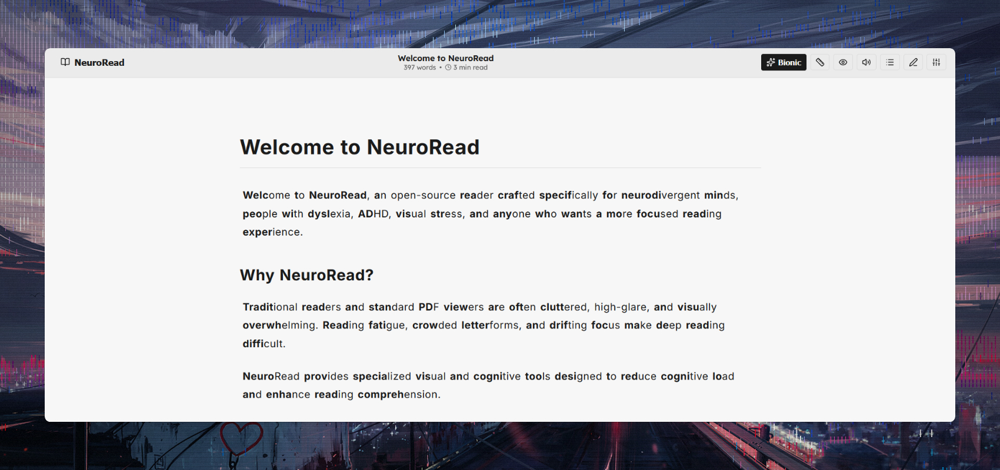

<div align="center">
  
  <h1>NeuroRead</h1>
  <p>
    A sleek, minimal, and self-hostable <strong>Svelte 5 + Bun</strong> Markdown and PDF reader<br>
    designed specifically for <strong>neurodivergent readers, ADHD, and dyslexia</strong>.
  </p>
</div>

<h1 align="center" style="color:#00ff00; font-family:monospace;"></h1>

## Features

**Documents**
- PDF to clean Markdown conversion
- Direct `.md` and `.txt` upload
- In-browser Markdown editor
- Persistent storage in `./data`
- Download any document

**Bionic Reading**
- Bolds the first half of each word only
- Does not change letter color
- Preserves headings, links, tables and code

**Typography**
- Lexend, OpenDyslexic, Atkinson Hyperlegible, Comic Neue, Inter, JetBrains Mono
- Adjustable font size, line spacing, letter spacing, word spacing and column width

**Focus tools**
- Reading line ruler
- Spotlight mask
- Active paragraph isolation
- Reduced motion
- Text-to-speech

**Themes**
- Pure black + white
- Pure white + black
- Soft dark and soft light
- Custom monochrome colors

All settings are saved locally. No tracking.

<h1 align="center" style="color:#00ff00; font-family:monospace;"></h1>

## Keyboard Shortcuts

| Shortcut | Action |
|----------|--------|
| `B` | Toggle Bionic Reading |
| `R` | Toggle Reading Ruler |
| `S` | Open Settings |
| `D` | Open Library |
| `E` | Toggle Edit Mode |
| `Esc` | Close modals |
| `Alt` + `↑` / `↓` | Move Reading Ruler |

<h1 align="center" style="color:#00ff00; font-family:monospace;"></h1>

## Quickstart

```bash
git clone https://github.com/4ngel2769/neurodivergent-reader.git
cd neurodivergent-reader
docker compose up -d
```

Open http://localhost:3000  
Files are stored in `./data`.

<h1 align="center" style="color:#00ff00; font-family:monospace;"></h1>

## Local Development

Requires [Bun](https://bun.sh/).

```bash
bun install
bun run dev
```

<h1 align="center" style="color:#00ff00; font-family:monospace;"></h1>

## License

MIT
